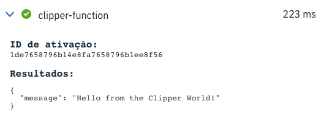
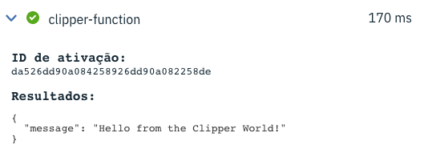

# Clipper Function

That's a really (really) geek experiment. :)
My dad is a Clipper programmer and I started as a programmer with Clipper.
I decided to create a serverless function with Clipper to proof that it's possible to create serverless no matter your programming language.

## How it works

* A Clipper file writes a JSON to the stdout
* A Python wrapper provides an HTTP endpoint to access the Clipper function (you may use anything with that wrapper)
* Create a Dockerfile to run the Python wrapper
* Create a Function in the IBM Cloud Functions

## Running

Create a docker image
```
docker build -t epiresdasilva/clipper-function .
```

Tag the docker image
```
docker tag epiresdasilva/clipper-function:latest epiresdasilva/clipper-function:0.0.1
```

Push to the Docker Hub
```
docker push epiresdasilva/clipper-function:0.0.1
```

Create a function in the IBM Cloud
```
ibmcloud fn action create clipper-function --docker epiresdasilva/clipper-function:0.0.1
```

## Stats

Above, the first call with cold start. The second one, without cold start.

1. Cold start activation



2. Without cold start activation

